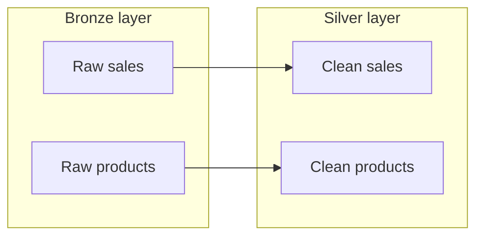

# test123

```mermaid
flowchart LR
    subgraph Bronze["Bronze layer"]
        RawSales[Raw sales]
        RawProducts[Raw products]
    end
    subgraph Silver["Silver layer"]
        CleanSales[Clean sales]
        CleanProducts[Clean products]
    end
    RawSales --> CleanSales
    RawProducts --> CleanProducts
```
